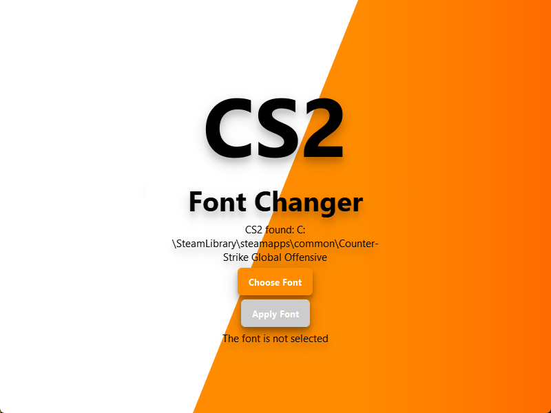

[РУ инструкция](https://github.com/N1k3YB/CS2FontChanger_ru)

# CS2 Font Changer

## Overview
CS2 Font Changer is a graphical utility for **modifying font configurations** in *Counter-Strike 2 (CS2)*, allowing users to easily replace the game's default font with a custom one of their choice. This tool uses **PyQt6** for its interface and performs modifications in the CS2 game directory to configure `fonts.conf` and `42-repl-global.conf` files with the specified font.

## Features
* **Automatic Detection**: Automatically locates the CS2 installation directory
* **Font Selection**: Allows users to choose any `.ttf` or `.otf` font file
* **Configuration**: Updates necessary CS2 configuration files with new font settings
* **Backup**: Creates backup copies of original configuration files with `.backup` extension for potential restoration

## Installation and Usage
1. **Download the Application**:
    * A: Download the archive with a self-contained (soon) or [integrated](https://drive.google.com/file/d/1SAlh9CpcLLgq2wO54OE4OmYDKGN3TbuV/view?usp=sharing) application
    * B: Extract to a convenient folder
    * C: Launch the application

2. **Select CS2 Path** (if not automatically detected):
   * If the CS2 path isn't found automatically, select the directory manually

3. **Choose Font**:
   * Click **"Choose Font"** to choose a font file from your computer

4. **Apply Font**:
   * Click **"Apply Font"** to change CS2 font settings
   * A success message will appear upon completion

## Modified Files in CS2
1. `fonts.conf`: Main configuration file for font processing in CS2
2. `42-repl-global.conf`: Font substitution settings file

Backup copies of these files are created with the `.backup` extension.

## Troubleshooting
* **Font Not Applying**: Ensure the font file is **not located in the same directory** as the `fonts.conf` file
* **Permission Issues**: Run the application with appropriate permissions if needed
* **Restoring Original Font**: Replace modified files with their `.backup` versions in CS2 configuration folders
